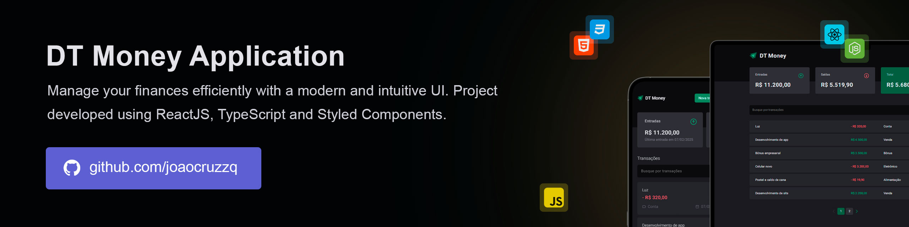

# DT Money  

Take charge of your financial life with a powerful yet simple tool. Monitor your expenses, track income, and stay on top of your balance. With clear insights into your spending, budgeting becomes effortless, giving you the power to manage your money with confidence.

> 🔥 Built with the latest web technologies to ensure fast speed, high performance, and a seamless user experience. It leverages modern tools to deliver a responsive and intuitive interface across devices.



## Running

Follow these steps to run the project locally:

1. Clone the repository:
   ```sh
   git clone https://github.com/joaocruzzq/dt-money.git
   cd ignite-timer
   ```

2. Install dependencies:
   ```sh
   npm install # Installs the required dependencies
   ```

3. Run the application:
   ```sh
   npm run dev # Starts the development server
   ```

> Note: Make sure you have <a href="https://nodejs.org/pt">Node.js</a> installed before starting.

## Features

> This application **should be able to**:

- register and manage income and expenses.
- view your balance and transaction summary.
- filter transactions by name, date or category.
- be fully responsive, optimized for both desktop and mobile devices.

## 🛠️ Technologies Used

| **Technology**               | **Description**                                                   | **Version**  |
|------------------------------|-------------------------------------------------------------------|-------------|
| **React**                    | A frontend library for building the user interface.              | 18.3.1      |
| **React Hook Form**          | A library for managing form state and validation in React.       | 7.54.2      |
| **Styled Components**        | A library for styling React components using tagged template literals. | 6.1.14      |
| **Phosphor React**           | A collection of lightweight icons for React applications.        | 1.4.1       |
| **Zod**                      | A TypeScript-first schema validation library.                    | 3.24.1      |
| **Vite**                     | A fast build tool and development server.                         | 6.0.5       |
| **TypeScript**               | A typed superset of JavaScript that provides static types.       | 5.6.2       |
| **@hookform/resolvers**      | A library for integrating external validation schemas with React Hook Form. | 3.10.0      |
| **@radix-ui/react**          | A set of low-level UI primitives for building accessible components. | 1.2.2       |
| **Axios**                    | A promise-based HTTP client for making requests in JavaScript.   | 1.7.9       |
| **json-server**              | A fake REST API for testing and prototyping.                     | 0.17.4      |
